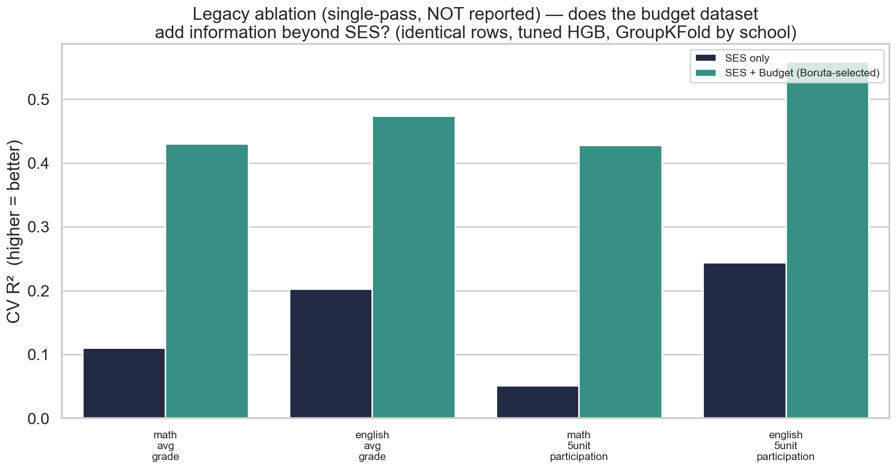
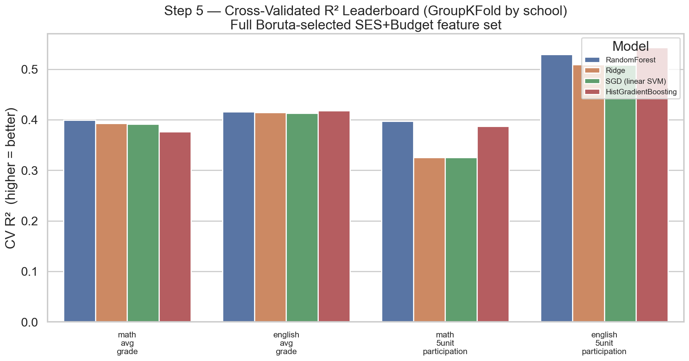
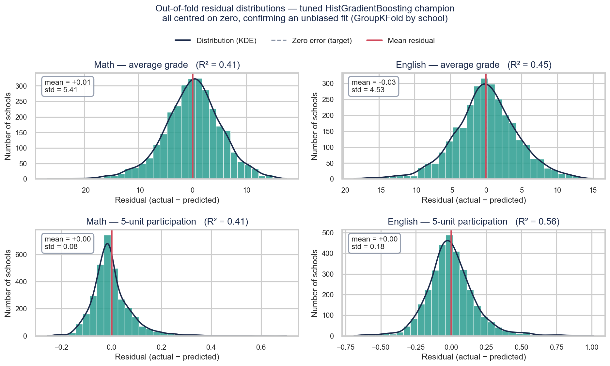
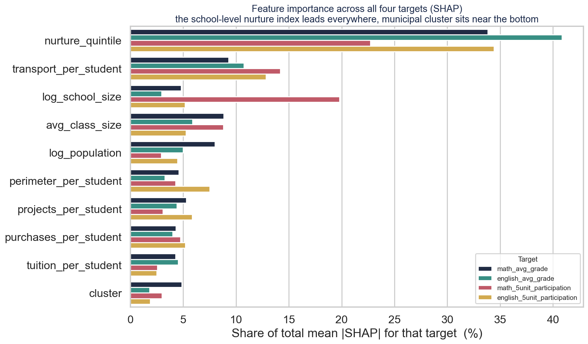
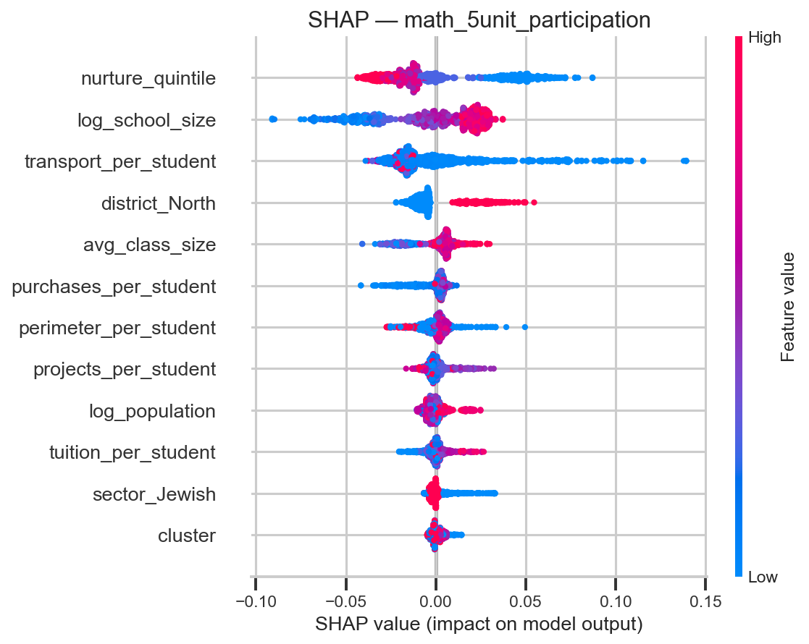

# 📊 Predicting Bagrut Success
### Municipal Socioeconomics & School-Level Institutional Resources

> An end-to-end, empirical data-science pipeline testing whether **municipal
> socioeconomic status and school-level institutional resources — together —
> predict Israeli high-school matriculation (Bagrut) outcomes** — from three
> raw Hebrew/administrative data sources to cross-validated, explainable
> machine-learning models.


**Authors:** Yousef Shihade & Shada Esawi · *Data Science Lab — Final Project, 2026*

---

## 📜 Project Evolution

This project began with a narrower goal: to test whether a municipality's
socioeconomic status **alone** could predict a high school's Bagrut
(matriculation) outcomes, using two data sources — Israeli Bagrut exam
records and the Central Bureau of Statistics' municipal socioeconomic index.
That first iteration built a complete five-stage pipeline (ingestion,
record linkage, feature engineering, preprocessing, and modeling) and
produced a working, cross-validated answer: municipal status alone is a
real but modest predictor of school performance.

While reviewing those results, we identified a clear limitation — a
municipality-level score cannot capture what actually happens inside a
specific school, such as its budget, staffing, class sizes, or
institutional profile. We located a third public data source, the Israeli
Ministry of Education's school-level budget and institutional report, and
tested whether incorporating it would add genuine explanatory power. It
did — substantially: models trained with school-level institutional data
alongside municipal socioeconomic data explained roughly three times more
variance in Bagrut outcomes than municipal status alone. Given the size of
that improvement, we made the decision to rebuild the pipeline so that all
**three** datasets are integrated from the very first stage, rather than
treating the third dataset as a late addition to an already-finished
analysis.

The current `main` branch reflects only this integrated, three-dataset
version of the project — it is the version described throughout this
README and the one intended for evaluation. The original two-dataset
pipeline is preserved in full, exactly as it was built and run, on the
[`archive/v1-two-dataset-pipeline`](https://github.com/Yousef-Shihade/predicting-bagrut-success/tree/archive/v1-two-dataset-pipeline)
branch, for anyone who wants to see the earlier analysis or compare the
two approaches directly.

---

## 🎯 Research Questions

1. **Main:** Can municipal socioeconomic status and school-level institutional
   resources, **combined**, meaningfully predict Israeli high-school Bagrut
   achievement and advanced-track participation?
2. **Secondary A:** Which subject — Math or English — is more **resilient** to
   socioeconomic and institutional disparity, and are there schools that
   consistently outperform their peers despite limited resources?
3. **Secondary B:** Which specific school-level factors — budget allocation,
   class size, sector, or supervision type — most strongly predict Bagrut
   outcomes, independent of municipal wealth?

We model four school-level targets: **average Bagrut grade** and **5-unit
(advanced-track) participation rate**, each for **Mathematics** and **English**.

---

## ✅ Direct Answers to the Research Questions

> Full evidence, methodology, and numbers for every answer below are in the
> [Modeling Leaderboard](#-modeling-leaderboard), [Ablation Study](#-ablation-study--does-institutional-funding-add-information-beyond-ses),
> and [Final Takeaways](#-final-takeaways) sections further down, and in the
> Step 4 / Step 5 READMEs linked inline.

**Main — Yes.** Municipal socioeconomic status and school-level institutional
resources, **combined**, meaningfully predict Bagrut outcomes: cross-validated
R² of **0.42–0.55** across all four targets, versus **0.06–0.23** for municipal
SES alone — a **~3× mean improvement** (ΔR² = +0.320). See the
[Modeling Leaderboard](#-modeling-leaderboard) and [Ablation Study](#-ablation-study--does-institutional-funding-add-information-beyond-ses).

**Secondary A — Math is the more resilient subject**, and yes, low-SES
overachiever schools exist. Going from the poorest to the wealthiest municipal
cluster, Math's performance gap is smaller than English's on both grade
(6.18 pts, d=0.91 vs 6.45 pts, d=1.16) and advanced-track participation (0.115
vs 0.367). Separately, **87 of 460 (18.9%) low-SES schools** match or beat the
elite-cluster median grade, with significantly higher advanced-track
participation (p < 0.0001 for both subjects). Full detail:
[Step 4 README](step_4_preprocessing_outliers_imputation_experiment/README.md#4-exploratory-questions).

**Secondary B — Per-student budget ratios and the Ministry's own school-level
disadvantage ranking, independent of municipal wealth.** Five budget ratios
(tuition, perimeter, projects, purchases, and transport per student) are
confirmed by Boruta for **every** target, and `nurture_quintile` — the
Ministry's school-level (not municipal) disadvantage ranking — is the single
most influential SHAP feature for all four targets, ahead of municipal
cluster every time. School **sector**, **supervision type**, and **district**
also carry confirmed, target-specific signal. Full detail:
[Step 5 README, §3 and §6](step_5_predictive_modeling_explainability/README.md#3-feature-selection--boruta-on-the-full-sesbudget-space).

---

## 🏗 Pipeline Architecture

The project is organised as **five isolated, self-contained, sequential
stages**. Each folder owns its own `README.md`, `config.yaml`, `code/`, data,
and graphs, and consumes the previous stage's output.

```
   datasets/  (raw Bagrut .csv + CBS .xlsx + Ministry budget .xlsx — git-ignored)
                 │
                 ▼
┌─────────────────────────────────────────────────────────────────────┐
│ STEP 1 · Ingestion & Standardization — ALL THREE DATASETS             │
│   utf-8-sig BOM · CBS header offset · openpyxl colour-patch for budget │
│   · Hebrew normalisation · single-year budget snapshot documented     │
└─────────────────────────────────────────────────────────────────────┘
                 │   bagrut_clean.csv · ses_clean.csv · budget_clean.csv
                 ▼
┌─────────────────────────────────────────────────────────────────────┐
│ STEP 2 · Three-Way Merge                                              │
│   Join A: Bagrut↔CBS fuzzy name (99.44%) · Join B: Bagrut↔Budget      │
│   exact semel key (99.68%) → one consolidated record-level table      │
└─────────────────────────────────────────────────────────────────────┘
                 │   merged_three_datasets.csv
                 ▼
┌─────────────────────────────────────────────────────────────────────┐
│ STEP 3 · Feature Engineering & Target Setup                           │
│   re-grain to school × year · 4 targets · 8 budget ratios + school-   │
│   level categoricals → candidate feature space 4 → 23                 │
└─────────────────────────────────────────────────────────────────────┘
                 │   school_level_features_targets.csv
                 ▼
┌─────────────────────────────────────────────────────────────────────┐
│ STEP 4 · Preprocessing, Outliers & MICE Robustness                    │
│   MICE × 25 independent trials · Isolation Forest + LOF · 2 questions │
└─────────────────────────────────────────────────────────────────────┘
                 │   cleaned_modeling_ready.csv
                 ▼
┌─────────────────────────────────────────────────────────────────────┐
│ STEP 5 · Modeling, Ablation & Explainability                          │
│   iterative VIF · Boruta (49 candidate cols) · Ridge/SGD/RF/HGB ·      │
│   SES-only vs SES+Budget ablation · SHAP                              │
└─────────────────────────────────────────────────────────────────────┘
```

### Repository layout

```
predicting-bagrut-success/
├── README.md  ·  LICENSE  ·  requirements.txt
├── datasets/                                  # raw inputs (git-ignored)
├── step_1_ingestion_standardization/
├── step_2_data_merging_integration/
├── step_3_feature_engineering_target_setup/
├── step_4_preprocessing_outliers_imputation_experiment/
└── step_5_predictive_modeling_explainability/
```

---

## 🧪 Key Experimental Footprints

**MICE robustness experiment (Step 4).** Our review of the imputation literature
established that a single masked-imputation run is not sufficient evidence of
stability, so we repeated the "mask 8% and reconstruct" test **25 times** with
independent random seeds:

| Method | R² (mean ± std across 25 runs) | RMSE (mean ± std) |
|---|---|---|
| **MICE (IterativeImputer)** | **0.9536 ± 0.0060** | 0.199 ± 0.016 |
| Median baseline | −0.0046 ± 0.0059 | 0.927 ± 0.037 |

➡️ **MICE beat the median baseline on all 25/25 runs**, with a standard
deviation of just 0.6% of the mean — proof the result is stable, not a lucky
draw.

**Other footprints:** 99.44% Hebrew locality match (Join A) / 99.68% exact
`semel` match (Join B) in Step 2 · Isolation Forest + LOF consensus of 49
outliers (Step 4) · 87/460 (18.9%) low-SES "overachiever" schools identified
(Step 4).

---

## 🏆 Modeling Leaderboard

Final **cross-validated** performance (5-fold **`GroupKFold` grouped by
school** so a school's multiple years never leak across folds). Champion =
**tuned HistGradientBoosting** on the full Boruta-selected SES+Budget feature
set, which won every target.

| 🎯 Target | R² | RMSE | MAE |
|---|--:|--:|--:|
| **english_5unit_participation** | **0.545** | 0.178 | 0.129 |
| `math_avg_grade` | 0.431 | 5.273 | 4.059 |
| `english_avg_grade` | 0.428 | 4.584 | 3.502 |
| `math_5unit_participation` | 0.421 | 0.079 | 0.056 |

> 🥇 Every model family scores **positive R² across the board** on this
> feature set — even RandomForest, typically the most overfit-prone model on
> a narrow feature space, performs solidly here (see the ablation study below
> for how much the SES+Budget feature set adds over SES alone).

---

## 🎯 Ablation Study — Does Institutional Funding Add Information Beyond SES?

For every target we tune HistGradientBoosting **twice on identical rows**:
once on the original SES-only feature set (`cluster`, `log_population`,
`locality_form`, `year`) and once on whatever **Boruta** selected from the
full SES+budget candidate space (49 encoded columns). Same rows, same
GroupKFold folds, same tuning protocol — so the R² delta is attributable
**only** to the extra information.

| 🎯 Target | SES only | **SES + Budget (Boruta-selected)** | **ΔR²** |
|---|--:|--:|--:|
| `math_avg_grade` | 0.138 | **0.458** | **+0.320** |
| `english_avg_grade` | 0.199 | **0.455** | **+0.256** |
| `math_5unit_participation` | 0.058 | **0.439** | **+0.381** |
| `english_5unit_participation` | 0.229 | **0.549** | **+0.321** |

*These values differ slightly from the leaderboard above because the ablation
restricts both arms to the row subset where **both** feature sets are complete —
a fair before/after comparison requires identical rows. Quote the leaderboard for
**model performance**, and ΔR² here for **how much the budget data adds**.*

> 📈 **Mean ΔR² = +0.320** — every target's explanatory power **more than
> doubled**. Five budget-derived ratios (tuition, perimeter, projects,
> purchases, and transport per student) are confirmed by Boruta for **every
> single target**, and the Ministry's own **school-level** disadvantage
> ranking (`nurture_quintile`) is, by a wide margin, the **single most
> influential feature in every SHAP ranking** — ahead of the municipal
> cluster every time. Full detail in
> [`step_5_predictive_modeling_explainability/`](step_5_predictive_modeling_explainability/README.md).



---

## 📈 Core Analytical Deliverables

**MICE robustness across 25 independent trials** — a tight, stable advantage
over the median baseline, not a one-off result.


**Subject resilience gap (cluster 2 → 9)** — Math's gap is smaller on both
grade and advanced participation: Math is the more resilient subject.


**Low-SES overachievers** — 18.9% of poor-locality schools match elite grades,
and they funnel markedly more pupils into advanced Math & English tracks.


**Cross-validated model leaderboard** — R² by model across the four targets,
full SES+Budget feature set.



**Residual diagnostics** — out-of-fold residuals for every tuned champion are
centred on zero (unbiased), with each target's spread matching its RMSE.



**SHAP across all four targets** — the school-level `nurture_quintile` leads
every outcome (22.7%–40.8% of attribution), while municipal `cluster` never
exceeds 4.9%. Same construct, different granularity.



**SHAP explainability** — for the target least explained by SES alone
(`math_5unit_participation`), school-level attributes (`nurture_quintile`,
`log_school_size`, `transport_per_student`) outrank the municipal cluster.



---

## 🏁 Final Takeaways

Across three independent methods — **iterative VIF/collinearity analysis**,
**Boruta feature confirmation**, and **SHAP attribution** — the same picture
emerges:

> **Municipal socioeconomic status alone is a weak-to-moderate predictor**
> of Bagrut outcomes (R² 0.06–0.23 in the SES-only arm). **Adding school-level
> institutional resources — budget ratios, class size, sector, supervision,
> district, and above all the Ministry's own school-level disadvantage ranking
> — roughly triples explanatory power** (R² 0.42–0.55). The variance municipal
> SES cannot explain is not noise: a large share of it is **institutional and
> structural school identity**, captured from the start of this pipeline
> rather than as an afterthought.

In short: **school-level circumstances predict Bagrut outcomes better than the
wealth of the town a school sits in** — and that gap is the project's central,
reproducible finding, corroborated by collinearity analysis, feature
selection, and explainability alike.

---

## ⚙️ Reproducing the Pipeline

```bash
# 1. Environment (Anaconda Python 3.11 recommended)
pip install -r requirements.txt

# 2. Place the three raw files in datasets/ (see data sources below)

# 3. Run each stage in order (each is CWD-independent and self-verifying)
python step_1_ingestion_standardization/code/run_step1.py
python step_2_data_merging_integration/code/run_step2.py
python step_3_feature_engineering_target_setup/code/run_step3.py
python step_4_preprocessing_outliers_imputation_experiment/code/run_step4.py
python step_5_predictive_modeling_explainability/code/run_step5.py
```

### 📦 Data sources (raw files are git-ignored, not redistributed)

- **Dataset 1 — Bagrut Grades 2013–2016** (Israeli Freedom of Information Law),
  Kaggle: <https://www.kaggle.com/datasets/emachlev/bagrut-israel/data>
- **Dataset 2 — CBS Socioeconomic Index**: Israel Central Bureau of Statistics,
  <https://www.cbs.gov.il/>
- **Dataset 3 — Ministry of Education School-Budget Report** (per-institution
  budget & enrolment): Israel Ministry of Education info-center,
  <https://infocenter.education.gov.il/all/sense/app/4f021b9e-f3c8-48f0-b349-a29eb97833a9/sheet/013b1d75-d09a-4ad3-9c4e-84085c3cca63/state/analysis>
  — a **single-year (2014/15) snapshot**, joined statically across all Bagrut
  years; see [Step 1's README](step_1_ingestion_standardization/README.md#4-verified-results)
  for the full limitation note.

---

## 🔬 Methods Coverage

| Category | Method | Stage |
|---|---|---|
| Imputation | **MICE** (IterativeImputer, 25-iteration robustness) | Step 4 |
| Outlier detection | **Isolation Forest**, **Local Outlier Factor** | Step 4 |
| Modeling | **SGD** (linear SVM), Ridge, RandomForest, **HistGradientBoosting** | Step 5 |
| Feature selection | **Boruta** (49-column candidate space) | Step 5 |
| Explainability | **SHAP** | Step 5 |
| Collinearity | **Iterative VIF pruning** | Step 5 |
| Multi-source integration | **3 datasets merged from Step 1** (fuzzy name + exact `semel` joins) | Steps 1–2 |

---

## 🧰 Tech Stack

`Python 3.11` · `pandas` · `numpy` · `scikit-learn` · `statsmodels` · `shap` ·
`Boruta` · `rapidfuzz` · `matplotlib` · `seaborn` — pinned in
[`requirements.txt`](requirements.txt).

## 📄 License

Released under the [MIT License](LICENSE) © 2026 Yousef Shihade & Shada Esawi.
