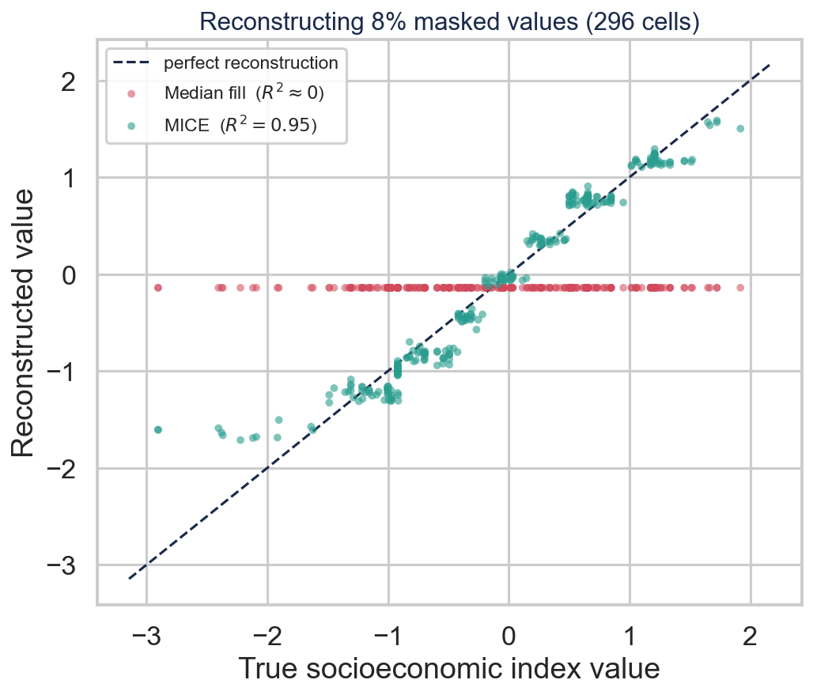

# Step 4 — Preprocessing, Outliers & MICE Robustness

**Project:** Predicting Bagrut Success from Municipal Socioeconomics and School-Level Institutional Resources
**Authors:** Yousef Shihade & Shada Esawi

> This step prepares the modelling table in three parts: a **quantitative
> justification for the imputation strategy**, **outlier detection**, and the
> **exploratory analysis** behind the secondary research questions. Because a
> single masked-imputation run cannot separate a genuine advantage from a
> favourable random mask — a point the imputation literature is explicit about —
> the imputation experiment runs **25 times** with independent seeds and reports
> the full distribution rather than one number.

---

## 1. Directory structure

```
step_4_preprocessing_outliers_imputation_experiment/
├── README.md
├── config.yaml                    # 25 iterations, outlier feature space, exploratory params
├── code/
│   ├── io_load.py                 # load Step-3 table + combined_avg_grade, log_total_takers
│   ├── imputation_experiment.py   # NEW: 25-iteration MICE robustness
│   ├── outliers.py                # Isolation Forest + LOF
│   ├── exploratory.py             # Q1 resilience + Q2 overachievers
│   └── run_step4.py               # orchestrator + verification summary
├── data/
│   ├── cleaned_modeling_ready.csv     # 3,731 × 54 (targets, features, outlier flags)
│   └── mice_robustness_runs.csv       # per-run detail, all 25 trials
└── graphs/
```

Run: `python code/run_step4.py`.

---

## 2. MICE robustness — 25 independent trials

**Why 25 runs, not 1.** One masked draw could be lucky or unlucky. Repeating with
25 different random seeds (same 8% mask fraction, same predictor set, same
`IterativeImputer` config each time) shows whether the result is a stable
property of the method or a fluke of one draw.

**Setup:** mask `index_value` (100% complete CBS feature) on **296 rows** (8% of
3,697) per run; reconstruct with MICE (`IterativeImputer` + `BayesianRidge`) and a
median baseline; score both against the true hidden values. The predictor set is
the **full 14 columns** available at this stage, budget-derived features
included, so the test reflects the dataset the models will actually see.

### Results across 25 runs

| Method | R² (mean ± std) | R² range | RMSE (mean ± std) |
|---|---|---|---|
| **MICE** | **0.9536 ± 0.0060** | 0.9405 – 0.9645 | 0.199 ± 0.016 |
| Median baseline | −0.0046 ± 0.0059 | ≈ 0 throughout | 0.927 ± 0.037 |

**MICE outperformed the median baseline on all 25/25 runs.**


The left panel's tight boxplot (std = 0.006, about 0.6% of the mean) and the right
panel's flat, non-drifting line across runs are the direct visual evidence that
the advantage is a stable property of the method, not an artefact of any one
random mask.

### Why MICE wins — a single representative run



Plotting reconstructed against true values for one run makes the mechanism
visible: MICE's points track the diagonal (predicted = true, R² ≈ 0.95), while
the median baseline collapses to a **flat horizontal line** — it returns the same
value for every masked cell, ignoring the feature structure entirely (R² ≈ 0).
This is the intuition behind the 25-run numbers above.

---

## 3. Outlier detection

Two complementary detectors — **Isolation Forest** (global anomalies) and
**Local Outlier Factor** (local-density anomalies) — run over a **9-feature
space** that includes `total_budget_per_student` and `avg_class_size`, so
institutional-resourcing anomalies are caught alongside outcome ones.

| | Isolation Forest | LOF | Consensus (both) |
|---|--:|--:|--:|
| Flagged | 167 | 167 | **49** |

Jaccard overlap = **0.172** — low, confirming the two detectors genuinely
capture different notions of "anomalous" rather than duplicating each other.
Only the **49 consensus** records are flagged
(`outlier_consensus`) — none are deleted from the data; they are simply
**excluded from model training** in Step 5 via a config switch, so they remain
fully auditable.


---

## 4. Exploratory questions

Both questions are **SES-only by design** — they ask how outcomes vary across the
municipal socioeconomic gradient, so they depend only on `cluster` and the 4
targets, deliberately holding the institutional features out. This keeps them a
clean read on socioeconomic disparity itself, which Step 5 then contrasts against
the full institutional picture.

**Q1 — Subject resilience** (cluster 2 → cluster 9 gap): **Math is more
resilient** — grade gap 6.18 pts (d=0.91) vs English 6.45 pts (d=1.16);
participation gap 0.115 (Math) vs 0.367 (English).

**Q2 — Low-SES overachievers**: **87 / 460 (18.9%)** of low-cluster (1–4) schools
match or exceed the elite-cluster (8–10) median grade (84.90); their advanced-track
participation is significantly higher (Math p=1.4e-05, English p=1.4e-11).

---

## 5. Step 4 verification checklist

- [x] MICE robustness run **25×** with independent seeds; MICE beats median on 25/25 runs.
- [x] MICE predictor set expanded to 14 columns (incl. budget features).
- [x] Per-run detail saved (`mice_robustness_runs.csv`) for full auditability.
- [x] Isolation Forest + LOF run on the expanded 9-feature space; 49 consensus outliers flagged (not deleted).
- [x] Exploratory Q1 (subject resilience) and Q2 (low-SES overachievers) computed
      with significance testing.
- [x] 5/5 plots saved (incl. the reconstruction scatter that shows *why* MICE beats the median).
- [x] `cleaned_modeling_ready.csv` (3,731 × 54) written.

**Status: Step 4 complete ✔**
