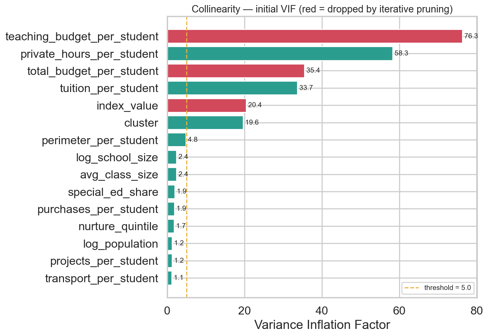
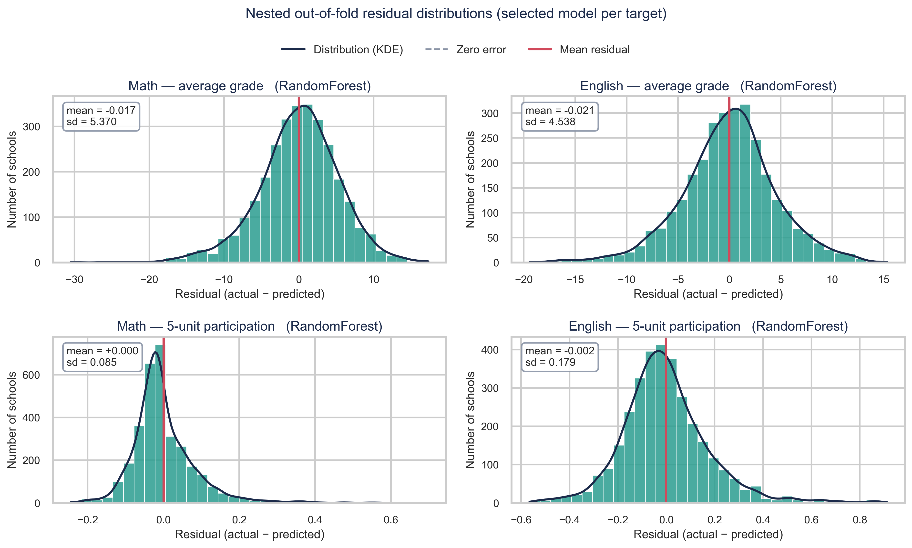

# Step 5 — Predictive Modeling, Ablation & Explainability

**Project:** Predicting Bagrut Success from Municipal Socioeconomics and School-Level Institutional Resources
**Authors:** Yousef Shihade & Shada Esawi

> The modelling stage. Collinearity is handled by **iterative VIF pruning**,
> features are chosen per target by **Boruta** over a 49-column SES+budget
> candidate space, and four model families compete under **nested
> GroupKFold(`semel`)** cross-validation with an equal tuning budget each. A
> dedicated **ablation study** then isolates how much the institutional data
> contributes over municipal socioeconomics alone — the study's central
> quantitative claim.
>
> **⚠️ Which numbers to quote.** `run_nested_cv.py` produces the **headline,
> leakage-free** results (`leaderboard_nested.csv`): feature selection and
> tuning run *inside outer training folds only*. `run_step5.py` is the older
> single-pass path kept for the SHAP/VIF/Boruta artefacts; its
> `leaderboard_tuned.csv` selects features and tunes on the full sample, so
> those figures are **optimistic and are not reported**.

---

## 1. Directory structure

```
step_5_predictive_modeling_explainability/
├── README.md
├── config.yaml              # candidate features, VIF threshold, Boruta params, ablation & display labels
├── code/
│   ├── io_load.py            # load Step-4 data; translate Hebrew categoricals; build X/y/groups
│   ├── feature_selection.py  # iterative VIF pruning + Boruta selection
│   ├── nested_cv.py          # HEADLINE: nested GroupKFold; selection+tuning inside training folds
│   ├── run_nested_cv.py      # runs nested CV for all 4 targets x 4 families -> leaderboard_nested.csv
│   ├── run_nested_ablation.py    # municipal-only vs full set, nested, identical rows
│   ├── run_outlier_sensitivity.py # anomalies retained vs excluded
│   ├── modeling.py           # older single-pass comparison (kept for reference)
│   ├── ablation.py           # older single-pass ablation (kept for reference)
│   ├── explain.py            # SHAP, leaderboard, ablation, VIF & residual plots
│   └── run_step5.py          # SHAP/VIF/Boruta artefacts (NOT the headline metrics)
├── models/                   # leaderboard_nested.csv + nested_per_fold.csv  <- REPORTED
│                             # ablation_nested.csv, outlier_sensitivity.csv
│                             # (leaderboard_cv / leaderboard_tuned = older, optimistic)
└── graphs/                   # VIF pruning, SHAP beeswarms + core ranking,
                              #   residuals_nested, ablation
```

Run the headline evaluation: `python code/run_nested_cv.py`
Then: `run_nested_ablation.py`, `run_outlier_sensitivity.py`, `run_step5.py`.

---

## 2. Collinearity — iterative VIF pruning

With 15 numeric candidates, redundancy can hide anywhere, and checking pairs by
hand does not scale. This step therefore **repeatedly** computes VIF, drops the
single worst offender, and **recomputes** — because dropping one feature can
resolve another's inflation, which a naive one-pass cutoff would miss entirely.



| Step | Dropped | VIF at drop |
|---|---|--:|
| 1 | `teaching_budget_per_student` | 76.57 |
| 2 | `total_budget_per_student` | 26.28 |
| 3 | `index_value` | 20.59 |

**12 numeric features survive.** The chart shows *why* iteration matters:
`cluster` starts at VIF 20.0 (would look collinear on a naive single pass) but
**survives**, because its inflation was entirely caused by `index_value` — once
that's dropped, cluster's recomputed VIF falls well under the threshold. This
correctly identifies `cluster ↔ index_value` as a **mutual** redundant pair and
keeps the more interpretable of the two, alongside two redundant budget pairs
that no manual inspection had anticipated.

---

## 3. Feature selection — Boruta on the full SES+budget space

Boruta ran **once per target** on the 12 VIF-surviving numeric features + 7
categoricals (locality_form, district, sector, supervision, legal_status,
education_stage, **year**) — 49 encoded candidate columns in total.

### Why `year` is treated as categorical

Feeding `year` (2013–2016) as a plain number would implicitly assume each year
shifts the outcome by a fixed, linear amount. With only four discrete exam
periods there is no basis for that: nothing says the 2013→2014 change should
equal the 2015→2016 change, and imposing linearity discards that flexibility for
nothing in return. `year` is therefore **one-hot encoded into 4 independent
columns** (`year_2013` … `year_2016`) — each period gets its own effect, the
same treatment every other categorical (sector, district, …) receives.

**Result: no individual year-dummy is confirmed by Boruta for any target.**
Non-selection does not establish the *shape* of a temporal trend, but it does
mean no single exam year carried enough independent signal to be retained, so no
headline result rests on a particular year.

**A 9-feature core is confirmed for all four targets:** `log_population`,
`nurture_quintile`, `avg_class_size`, `log_school_size`, and the five per-student
budget ratios (`tuition`, `perimeter`, `projects`, `purchases`, `transport`).
On top of that shared core, each target confirms its own additions:

| Target | Additional features beyond the 9-feature core | Total |
|---|---|--:|
| `math_avg_grade` | **cluster**, supervision_Haredi | **11** |
| `math_5unit_participation` | **cluster**, district_North, sector_Jewish | **12** |
| `english_5unit_participation` | **cluster**, private_hours_per_student, sector_Jewish, supervision_Haredi | **13** |
| `english_avg_grade` | district_North, private_hours_per_student, special_ed_share, sector_Bedouin | **13** |

> **Municipal `cluster` is NOT in the shared core.** It is confirmed for three
> targets and **rejected outright for `english_avg_grade`** — the single
> sharpest indication that the municipal measure is the weaker one.

Extras are **genuinely target-specific, not cumulative**: `supervision_Haredi` is
confirmed for `math_avg_grade` but not for `english_avg_grade`. Both English
targets pick up `private_hours_per_student`, which neither Math target does.
Note this field is the Ministry's **individual/small-group instruction hours**
allocation (שעות פרטניות), *not* commercial private tutoring.

**Five budget ratios are confirmed for every single target**
(`tuition_per_student`, `perimeter_per_student`, `projects_per_student`,
`purchases_per_student`, `transport_per_student`) — a much richer, more stable
selection story than municipal features alone can support. Boruta also
confirms specific **sector/supervision/district** dummies per target — school
structural identity carries real, independent signal beyond municipal cluster.

Full per-target detail: `models/boruta_report.csv`.

---

## 4. Nested cross-validation — the headline evaluation

Two kinds of leakage matter. **Structural**: each school contributes up to four
year-rows, so folds are formed by school with GroupKFold(`semel`). **Selection**:
if Boruta or hyperparameter tuning sees the whole dataset, the evaluation folds
have already shaped the model and scores come out optimistic.

`run_nested_cv.py` therefore **nests** the whole procedure:

```
OUTER GroupKFold(semel)              <- untouched evaluation folds
  within each outer TRAINING fold only:
      iterative VIF pruning
      Boruta selection
      RandomizedSearchCV (INNER GroupKFold, 25 draws)
  -> score once on the held-out OUTER fold
```

**Every family gets the same 25-draw budget**, so the comparison is fair. (An
earlier version tuned only HGB, which made "HGB wins" an artefact of unequal
effort rather than a property of the data.)

### Leaderboard — outer-fold R² (mean ± sd over 5 folds)

| Target | Ridge | SGD | **Random Forest** | HistGB |
|---|--:|--:|--:|--:|
| `math_avg_grade` | .405±.066 | .402±.058 | **.420±.050** | .414±.054 |
| `english_avg_grade` | .410±.045 | .410±.043 | **.452±.042** | .441±.043 |
| `math_5unit_participation` | .323±.043 | .323±.041 | **.395±.037** | .378±.030 |
| `english_5unit_participation` | .502±.036 | .504±.037 | **.557±.053** | .539±.064 |

**RandomForest is selected for every target.** Saved to
`models/leaderboard_nested.csv`, with the full audit trail in
`nested_per_fold.csv`.

Two honest caveats. On the **grade** targets all four families sit within about
one standard deviation of each other, so the algorithm matters far less than the
features. The trees separate more clearly on **participation**, where the outcome
is bounded and relationships are less linear.

Errors in original units: MAE **4.11 / 3.45 grade points** (Math / English) and
**5.8 / 13.1 percentage points** for advanced participation.

### Residual diagnostics



Built from **nested out-of-fold predictions** — rows never seen during selection
or tuning. Every mean residual is within 0.03 of zero, so there is no material
*global* bias (this does not rule out subgroup or calibration bias). Grade
residuals are near-symmetric; participation residuals are mildly **right-skewed**
because the outcome is itself bounded and right-skewed.

---

## 5. 🎯 Ablation study — does the budget dataset add information beyond SES?

This is the study's central experiment, re-run under the **same nested protocol**
as §4 (`run_nested_ablation.py`). For every target, RandomForest is evaluated
**twice on IDENTICAL rows**: once on municipal features only (`cluster`,
`log_population`, `locality_form`, `year`) and once on the full candidate set
with selection performed inside each training fold. Only the available
information differs.

| Target | Rows | Municipal | **Full set** | **ΔR²** | Folds improved |
|---|--:|--:|--:|--:|--:|
| `math_avg_grade` | 2,995 | .109±.019 | **.420±.050** | **+.311±.040** | 5/5 |
| `english_avg_grade` | 2,963 | .196±.028 | **.452±.042** | **+.256±.034** | 5/5 |
| `math_5unit_participation` | 3,221 | .055±.033 | **.395±.037** | **+.340±.039** | 5/5 |
| `english_5unit_participation` | 3,226 | .229±.050 | **.557±.053** | **+.328±.043** | 5/5 |

**Mean ΔR² = +0.309**, and the gain holds in **all 20 outer folds** (5 folds × 4
targets), so it is not an artefact of a favourable split.

> **The Full-set column now matches §4's leaderboard exactly**, because both come
> from the same nested evaluation on the same rows. The older single-pass
> ablation needed a footnote explaining why the two disagreed; that discrepancy
> is gone.

The result is **associational**: it establishes incremental *predictive* value,
not a causal effect of school resources.

### Sensitivity — does excluding the 49 anomalies matter?

Step 4's consensus-anomaly detector uses a feature space that **includes outcome
variables**, so dropping those rows would condition the sample on the target. The
primary analysis therefore keeps every valid school.
`run_outlier_sensitivity.py` quantifies the alternative:

| | Retained (primary) | Excluded | Diff |
|---|--:|--:|--:|
| Mean R² across 4 targets | .456 | .457 | **+0.001** |

Per-target shifts run −0.023 to +0.013, all well inside fold-to-fold variation.
**The choice is immaterial to the findings.**

---

## 6. SHAP explainability

### Cross-target ranking — what carries the weight everywhere


Mean |SHAP| for the **9-feature shared core plus municipal `cluster`**, expressed
as a share of each target's total so the four outcomes are comparable on one
scale. The school-level **`nurture_quintile`** is the **top feature for all four
targets** (21.8%–41.6%), while municipal **`cluster`** never exceeds **4.6%** and
is labelled *"not selected"* for `english_avg_grade`, where Boruta rejected it
outright. Both measure socioeconomic standing, so the contrast is about
**granularity**: the school-level measure carries signal the municipal average
washes out. The transport budget line ranks 2nd or 3rd for every target, and
`log_school_size` is especially strong for advanced Math participation (19.0%).

> **Two caveats on reading this chart.** SHAP values here describe the **final
> model fitted on all rows**, so they explain that model rather than held-out
> predictions. They also report **magnitude, not direction** — see the beeswarm
> below for directionality.
>
> `nurture_quintile` runs **1–5 where HIGHER = MORE disadvantaged** (mean
> combined grade falls 85.3 → 74.1 from quintile 1 to 5). It is missing for
> **11.9%** of school-years, and those rows leave the complete-case sample.

### Per-target detail


For `math_5unit_participation` — the target municipal SES explains least
— the top SHAP features are `nurture_quintile`, `log_school_size`, and
`transport_per_student`, with `district_North` and `avg_class_size` also
ranking above `cluster`. **Institutional/school-level attributes outrank
municipal wealth** for explaining who enters advanced Math — direct, visual
confirmation of the ablation result.

---

## 7. Headline answer to the research question

**Municipal socioeconomic status alone is a weak predictor** (R² 0.055–0.229).
**Adding school-level institutional features roughly triples predictive power**
(R² 0.395–0.557, mean ΔR² = **+0.309**, improving in all 20 outer folds). The
school-level variables therefore carry substantial predictive information beyond
the municipal ones. This is an **associational** finding under the evaluated
protocol, not evidence of a causal effect of school resources.

---

## 8. Step 5 verification checklist

- [x] Iterative VIF pruning run on the full 15-candidate numeric set; 3 dropped
      (2 new budget redundancies + the known cluster/index_value pair), with the
      mutual-pair logic demonstrated visually.
- [x] `year` treated as 4 one-hot categories, not an assumed linear trend;
      Boruta confirms none individually — headline results unchanged.
- [x] Boruta run per target on the full 49-column SES+budget space; 11–13
      features confirmed per target, 9 shared by all four.
- [x] **Nested** GroupKFold: VIF, Boruta and tuning run inside outer *training*
      folds only, so no evaluation fold influences a modelling decision.
- [x] **All four families tuned with an equal 25-draw budget**; RandomForest is
      selected on every target. (The earlier "HGB champion" result came from
      tuning only HGB.)
- [x] Results reported as **mean ± sd across outer folds**, with the full
      per-fold audit trail in `nested_per_fold.csv`.
- [x] Ablation re-run under the same nested protocol on identical rows; mean
      ΔR² = **+0.309**, improving in **20/20** folds.
- [x] Primary analysis **retains all valid schools**; outlier exclusion reported
      as a sensitivity check (effect: +0.001 mean R², immaterial).
- [x] Residual diagnostics built from **nested out-of-fold predictions**, 300 dpi.
- [x] SHAP beeswarms for all 4 targets; Hebrew categorical values translated to
      English, and two literal field-name translations corrected.
- [x] Cross-target SHAP ranking (`shap_core_ranking.png`): `nurture_quintile`
      leads all 4 targets; municipal `cluster` never exceeds 4.6% and is not
      selected at all for `english_avg_grade`.

**Status: Step 5 complete ✔**
